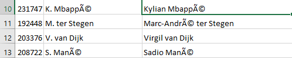
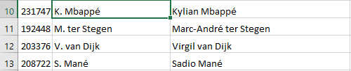

# FIFA 21 DATA CLEANING WITH MICROSOFT EXCEL

## Introduction
This is a data-cleaning project carried out using Microsoft Excel tools and functions. As a participant in the data cleaning challenge organized by Promise Chinonso and Victor Somadina, I opted to utilize Excel in carrying out this daunting task. Microsoft Excel has a friendly user interface with easy-to-understand functions and features that aid data cleaning. Also, the data set was within Excel's handling capacity, hence my reason for using it for this challenge. The challenge spanned 7 days between March 10-16th earlier this year.
## About the data set
The data set used was obtained from [Kaggle](https://www.kaggle.com/datasets/yagunnersya/fifa-21-messy-raw-dataset-for-cleaning-exploring). It contains various attributes and statistics of players in the popular video game FIFA 21, such as player ratings, skill moves, preferred positions, and more. The data set consists of 18,979 rows and 77 columns of data.
## The purpose of data cleaning
The purpose of data cleaning, also known as data cleansing or data scrubbing, is to improve the quality and reliability of data by identifying and correcting or removing errors, inconsistencies, and inaccuracies. Data cleaning is an essential step in the data preparation process and plays a crucial role in ensuring the accuracy and integrity of data for analysis, reporting, and decision-making purposes.
## The data-cleaning process
### Checking for nulls and duplicates
In order to achieve this quickly, the 'Remove Duplicates' option on the Data tab was used while the Filter button was used to check for null and blank columns. No duplicates existed but there were some blank fields which were noted and addressed accordingly in the later steps.
### Correcting the character-encoding problem
It was observed that in many columns of the data set, there were characters with a different encoding than others. To correct this problem, the 'Find and Replace' option was used. The characters with this problem were googled to obtain their correct replacement.

 Wrong Encoding        |     Correct Encoding 
:---------------------:|:---------------------:
    |  
### Renaming and unwrapping of text
The column named '↓OVA' was renamed to 'OVA'. The text in the 'Club' column was unwrapped to reveal the names of the various clubs the players were registered to. It was also observed that some entries in this column contained an additional character "1. " and this was also cleaned using the Find and Replace option.
