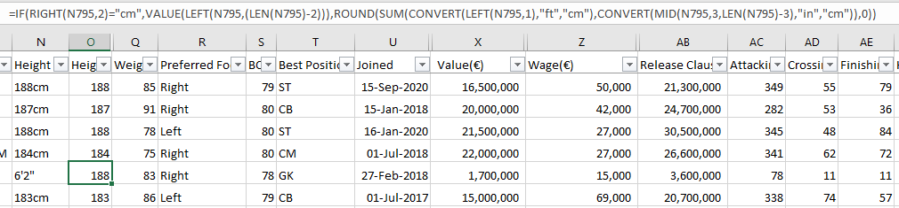
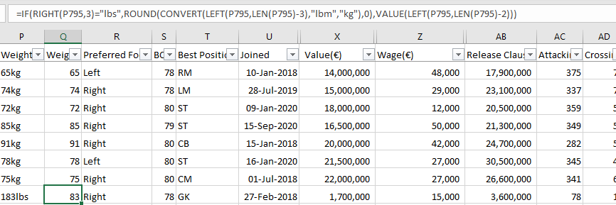
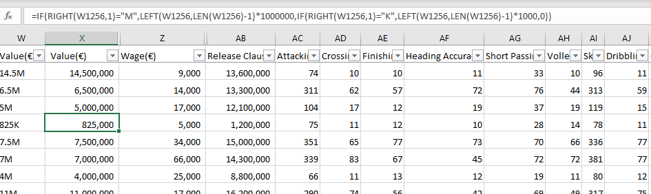

# FIFA 21 DATA CLEANING WITH MICROSOFT EXCEL

## Introduction
This project demonstrates the power and capabilities of Microsoft Excel in performing data-cleaning tasks. As a participant in the data cleaning challenge organized by Promise Chinonso and Victor Somadina, I opted to utilize Excel in carrying out this daunting task. Microsoft Excel has a friendly user interface with easy-to-understand functions and features that aid data cleaning. Also, the data set was within Excel's handling capacity, hence my reason for using it for this challenge. The challenge spanned 7 days between March 10-16th earlier this year.
## About the data set
The data set used was obtained from [Kaggle](https://www.kaggle.com/datasets/yagunnersya/fifa-21-messy-raw-dataset-for-cleaning-exploring). It contains various attributes and statistics of players in the popular video game FIFA 21, such as player ratings, skill moves, preferred positions, and more. The data set consists of 18,979 rows and 77 columns of data.
## The purpose of data cleaning
The purpose of data cleaning, also known as data cleansing or data scrubbing is to improve the quality and reliability of data by identifying and correcting or removing errors, inconsistencies, and inaccuracies. Data cleaning is an essential step in the data preparation process and plays a crucial role in ensuring the accuracy and integrity of data for analysis, reporting, and decision-making purposes.
## The data cleaning process
### Checking for nulls and duplicates
In order to achieve this quickly, the 'Remove Duplicates' option on the Data tab was used while the Filter button was used to check for null and blank columns. No duplicates existed but there were some blank fields which were noted and addressed accordingly in the later steps.
### Correcting the character-encoding problem
It was observed that in many columns of the data set, there were characters with a different encoding than others. To correct this problem, the 'Find and Replace' option was used. The characters with this problem were googled to obtain their correct replacement.

 Wrong Encoding        |     Correct Encoding 
:---------------------:|:---------------------:
    |  
### Renaming and unwrapping of text
The column named '↓OVA' was renamed to 'OVA'. The text in the 'Club' column was unwrapped to reveal the names of the various clubs the players were registered to. It was also observed that some entries in this column contained an additional character "1. " and this was also cleaned using the Find and Replace option.
### Splitting columns and extracting data from other columns
The contract column was observed to have a delimiter that indicated the beginning and end of each player's contract, while some were on loan. The 'Text to Columns' option on the Data tab was used to split the Contract column into 'ContractStart' and 'ContractEnd'. Upon keen observation, the year in the 'Joined' column matched the 'ContractStart' for each player and this was used in completing the data. For players who were on loan or without a club, their 'ContractStart' year was obtained from the 'Joined' column using the TEXT function. The year in the 'Loan Date End' column was also extracted into the 'ContractEnd' column for players on loan. The 'Text to Columns' option was also used to separate special characters from the 'W/F', 'SM', and 'IR' columns to obtain their appropriate values.
 Dirty Contract        |     Clean Contract 
:---------------------:|:---------------------:
     |  
### Converting to uniform measurements
The 'Height' and 'Weight' columns had a problem of non-uniformity. While some players' height was measured in feet and inches, those of others were measured in centimeters. Most players had their weight measured in kilograms while that of a few were measured in pounds. This non-uniformity was corrected using a combination of several Excel functions like IF, RIGHT, VALUE, LEFT, LEN, ROUND, SUM, MID, and CONVERT.
 Height Conversion         |   
:-------------------------:|
    | 
 
 Weight Conversion         |
:-------------------------:|
    |
### Converting occurrences of 'K' and 'M' in numerical columns
In many of the numerical columns, K was used to denote Thousands while M denoted Millions. This was the case for 'Value', 'Wage', and the 'Release Clause' columns. A few occurrences of 'K' was found in the Hits column as well and they were all converted accordingly using a combination of several Excel functions like IF, RIGHT, LEFT, and LEN.
 Value Conversion          |   
:-------------------------:|
  | 
 
 Wage Conversion           |
:-------------------------:|
   |
### Dropping irrelevant columns
After clean data have been captured from the dirty data, it is not mandatory to drop irrelevant columns. However, if a column is irrelevant to your analysis or does not contribute meaningful information to your task, dropping it can help simplify and streamline your data set, making it easier to work with. Removing irrelevant columns can also reduce noise, improve computational efficiency, and focus your analysis on the most relevant variables.

In this regard the 'photoUrl', 'Loan Date End', and 'Contract' columns are irrelevant. The reason is that the 'photoUrl' contains invalid URLs while data had been extracted from the 'Contract' and 'Loan Date End' columns into the 'ContractStart' and 'ContractEnd' columns. Microsoft Excel has an option to 'Hide' columns and this option was used instead of an outright delete.

NB: The cleaned data set is available in this repository for anyone hoping to carry out further analysis.
## Conclusion
This project has not only enhanced my proficiency in Microsoft Excel but also strengthened my data-cleaning skills. Looking ahead, I am eager to tackle similar tasks using the 'Almighty' SQL in the near future. :smile: 

